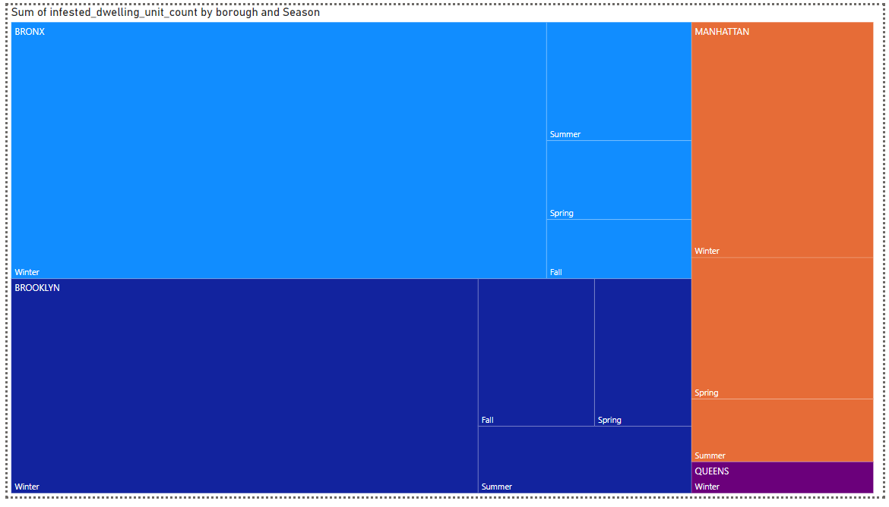

(HW 1)--------------------------------------------------------
**Data Sourcing**

Link of all data sources:
https://data.cityofnewyork.us/Housing-Development/Bedbug-Reporting/wz6d-d3jb/about_data 

Explanation of the data (where does it come from):
The data comes from property owners where they ask either tenets or dwelling unit owners about any infestation history from the unit they live in. 

Link that shows the data dictionary (excel, google sheets):
https://docs.google.com/spreadsheets/d/12wFghZGdv9o87J3iLkzxNoAF4qLI5b85x-efySBT1o8/edit?usp=sharing 

I created a script to briefly analyze what kind of data I was dealing with, what kind of tranformations I could do, and business problems I could solve.

--------------------------------------------------------
**Storage**

Google Cloud Storage was choosen for my data, due to my familiarity with it. I programatically uploaded my bed bug data. The process consisted of uploading to a blob, creating a dataset, creating a data table with my blob data. Upon inspection, I took note that the data types were off so I had to create another python script to update the data types. 
--------------------------------------------------------
**Modeling**

Using DbSchema I was able to create a logical model consisting my different dimensions and fact table. 

(HW 2)--------------------------------------------------------
**Transformation**
Transformation happened via Python, cleaning columns and adding a few columns I thought would be helpful in providing unqiue insights such as seasons along with the original business problem

--------------------------------------------------------
**Modeling**
--------------------------------------------------------
**Serving Data**
My data was transformed and I exported as a CSV file to my data warehouse (GCS). I used Power BI, for the first time, to serve the data and get interesting insights. I even added an extra graph.

